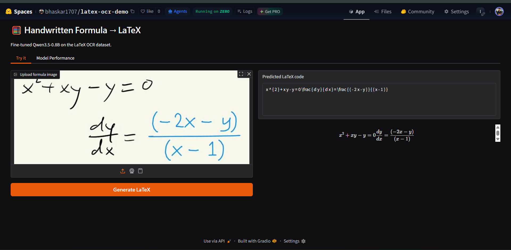
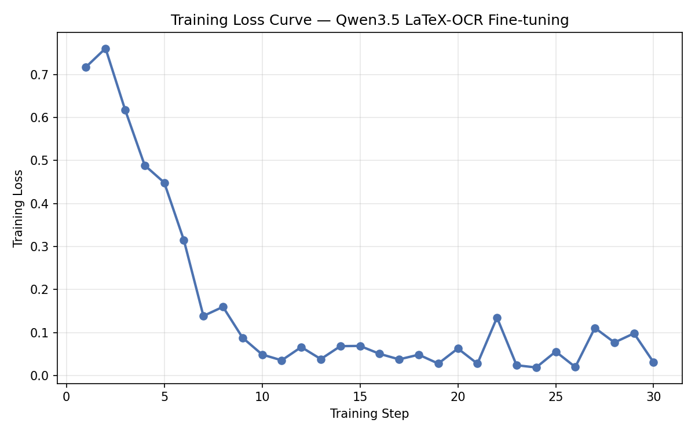
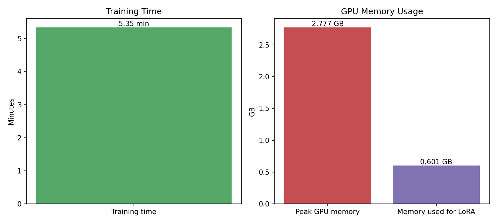
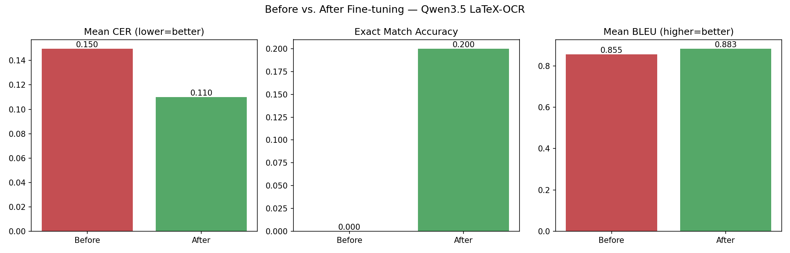

# Qwen3.5-0.8B — Fine-tuned for LaTeX OCR



This model is a fine-tuned version of [`unsloth/Qwen3.5-0.8B`](https://huggingface.co/unsloth/Qwen3.5-0.8B), a vision-language model, adapted to convert **images of handwritten/printed math formulas into LaTeX code**.

Fine-tuning was performed using [Unsloth](https://github.com/unslothai/unsloth) with LoRA (parameter-efficient fine-tuning) on the [`unsloth/LaTeX_OCR`](https://huggingface.co/datasets/unsloth/LaTeX_OCR) dataset.

## Model Details

- **Base model:** unsloth/Qwen3.5-0.8B (vision-language)
- **Fine-tuning method:** LoRA (r=16, alpha=16, all attention + MLP + vision layers)
- **Framework:** Unsloth + TRL (`SFTTrainer`)
- **Dataset:** `unsloth/LaTeX_OCR` — handwritten/printed math formula images paired with LaTeX transcriptions
- **Task:** Image → LaTeX transcription

## Training Setup

| Setting | Value |
|---|---|
| LoRA rank (r) | 16 |
| LoRA alpha | 16 |
| Learning rate | 2e-4 |
| Batch size (per device) | 2 |
| Gradient accumulation | 4 |
| Max steps | *30* |
| Optimizer | adamw_8bit |
| Hardware | *Colab T4* |
| Training time | *5.35 min* |
| Peak GPU memory | *2.78 GB* |




## Evaluation — Before vs. After Fine-tuning

Evaluated on a held-out split of 30 samples (not seen during training) from the same dataset, using Character Error Rate (CER), exact-match accuracy, and BLEU.

| Metric | Before fine-tuning | After fine-tuning |
|---|---|---|
| Mean CER ↓ | *0.150* | *0.110* |
| Exact match accuracy ↑ | *0.000* | *0.200* |
| Mean BLEU ↑ | *0.855* | *0.883* |




## Usage

```python
from transformers import AutoModelForImageTextToText, AutoProcessor
from PIL import Image
import torch

model_id = "bhaskar1707/qwen3.5-latex-ocr-finetune"

model = AutoModelForImageTextToText.from_pretrained(model_id, torch_dtype=torch.float16, trust_remote_code=True).to("cuda")
processor = AutoProcessor.from_pretrained(model_id, trust_remote_code=True)

image = Image.open("your_formula_image.png").convert("RGB")
instruction = "Write the LaTeX representation for this image."

messages = [{"role": "user", "content": [{"type": "image"}, {"type": "text", "text": instruction}]}]
input_text = processor.apply_chat_template(messages, add_generation_prompt=True)
inputs = processor(image, input_text, add_special_tokens=False, return_tensors="pt").to("cuda")

output_ids = model.generate(**inputs, max_new_tokens=128, temperature=1.5, min_p=0.1)
latex = processor.batch_decode(output_ids[:, inputs["input_ids"].shape[1]:], skip_special_tokens=True)[0]
print(latex)
```

Or with Unsloth (faster load/inference, requires a CUDA GPU):

```python
from unsloth import FastVisionModel

model, tokenizer = FastVisionModel.from_pretrained("bhaskar1707/qwen3.5-latex-ocr-finetune", load_in_4bit=True)
FastVisionModel.for_inference(model)
```

## Limitations

- Trained on a limited step budget for demonstration purposes; results may improve further with a full multi-epoch training run.
- Performance is best on formulas visually similar to the `LaTeX_OCR` dataset distribution; handwriting styles or symbols far outside this distribution may transcribe less accurately.
- As with any generative model, occasional hallucinated symbols or malformed LaTeX are possible, especially for long/complex expressions.

## Citation / Acknowledgements

- Base model and fine-tuning framework: [Unsloth AI](https://github.com/unslothai/unsloth)
- Dataset: [`unsloth/LaTeX_OCR`](https://huggingface.co/datasets/unsloth/LaTeX_OCR)

Fine-tuned by [Bhaskar Pal](https://bhaskarpal1707.github.io/portfolio) — [GitHub](https://github.com/bhaskarpal1707) · [LinkedIn](https://linkedin.com/in/bhaskar-pal-2k02)
